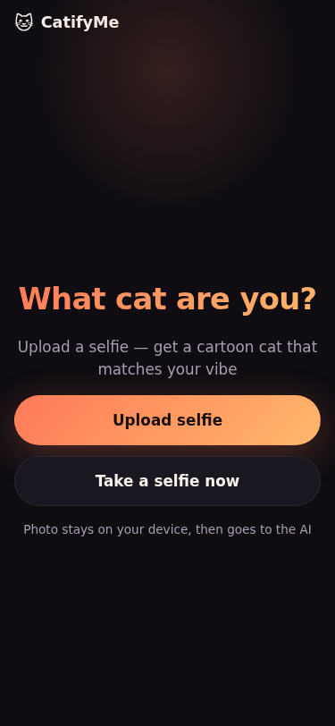

# CatifyMe

[](https://github.com/slaid098/catifyme/actions/workflows/test.yml)

> Upload a selfie — get a cartoon cat that matches your vibe. 🐱

<p align="center">
  
</p>

A mobile-first web app that turns your selfie into a cartoon cat character
with a name, breed, personality, and a fun fact. Powered by Puter.js under
the "user-pays" model — **free for the developer**, users cover their own AI
usage through Puter's free tier.

## How it works

1. User uploads a selfie (or takes one with the front camera).
2. A friendly bottom-sheet explains the one-time Puter sign-in (like "Sign in
   with Google") and that the user pays only for their own usage.
3. `puter.ai.chat()` (vision) analyzes the selfie and returns a JSON
   descriptor: `{cat_breed, cat_name, personality, fun_fact, img_prompt}`.
4. `puter.ai.txt2img()` generates a cartoon cat from that prompt.
5. The result card shows the cat plus metadata, with **Download** (watermarked
   via canvas) and **Share** (Web Share API with link fallback).

## Features

- 📱 Mobile-first, dark theme with warm accent colors
- 🌍 RU / EN with auto-detect via `navigator.language`, persisted in
  `localStorage` (override via `?lang=ru` / `?lang=en`)
- 🐾 Three-step loading progress (analyze → think → draw) with paw animation
- 🖼️ Canvas-composited watermark on every download for viral loop
- 🔍 SEO: `og:image`, `twitter:card`, JSON-LD `WebApplication`, sitemap, robots
- ♿ `prefers-reduced-motion` support, 44px tap targets, safe-area insets

## Stack

- Vanilla HTML5 / CSS3 / ES modules — **no build step, no framework**
- [Puter.js](https://developer.puter.com/) via CDN for AI vision + image gen
- Hosted on Vercel — `catifyme.vercel.app`

## Project structure

```
index.html          # markup + inline critical meta/SEO
styles.css          # mobile-first dark theme
app.js              # entry, orchestrates the flow
i18n.js             # ru/en switcher, auto-detect, localStorage
prompts.js          # vision prompt builder + fallback img prompt
puter-api.js        # wrappers: ensureSignedIn, analyzeSelfie, generateCat
share.js            # canvas watermark, Web Share API, clipboard fallback
locales/{ru,en}.json
assets/             # favicon, og-image, app screenshot
robots.txt, sitemap.xml
vercel.json         # static-asset cache headers
```

## Run locally

Any static file server works. Pick one:

```bash
# Python
python3 -m http.server 8000

# Node (no install)
npx serve

# Vercel CLI
vercel dev
```

Then open `http://localhost:8000`. No env vars, no API keys.

## Deploy to Vercel

1. Fork or import this repo at https://vercel.com/new
2. Framework Preset: **Other** (static)
3. Deploy — URL will be `<project>.vercel.app`
4. (Optional) Settings → Analytics → enable for free traffic insights

Auto-deploys on every push to `main`.

## Conventions

- [Conventional Commits](https://www.conventionalcommits.org/):
  `feat(scope): summary`, `fix(scope): summary`, `chore: ...`, `docs: ...`
- Short imperative subject line, lowercase, no trailing period
- See [`AGENTS.md`](./AGENTS.md) for full guidelines for AI assistants

## License

MIT — see [LICENSE](./LICENSE).
